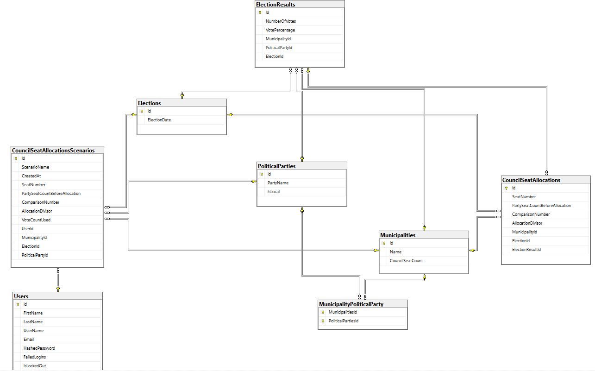

# ValKvoten

ValKvoten är en webbapplikation för laborering och analys av resultat vid kommunval. 
- Analysera resultatet innan det färdiga valresultatet kommit för att se hur mandat kan komma att fördelas. 
- Sortera partier i olika partigrupper och laborera med olika värden för att se hur mandatfördelningen förändras.
- Spara dina analyser antingen som PDF eller genom att skapa ett konto.

## Teknikstack
React/Vite med Vanilla JavaScript för frontend
ASP.NET Web Api
ASP.NET Core / .Net 10
Entity Framework Core
SQL Server Express

## Arbetssätt
- Fluent Api används och relationer beskrivs från barnets sida.

## Felhantering
Serilog används för att spara exceptions till fil Logs/log.txt,
I program.cs finns middleware för hantering av exceptions.

## Tabeller
- Elections = valets datum.
- Municipalitys = kommun.
- PoliticalPartys = politiskt parti.
- ElectionResults = original valresultat.
- CouncilSeatAllocations = originalversion av platstilldelning i kommunfullmäktige.
- CouncilSeatAllocationsScenarios = scenarier som användaren skapat och valt att spara gällande platstilldelning i kommunfullmäktige.
- Users = information om användare.

